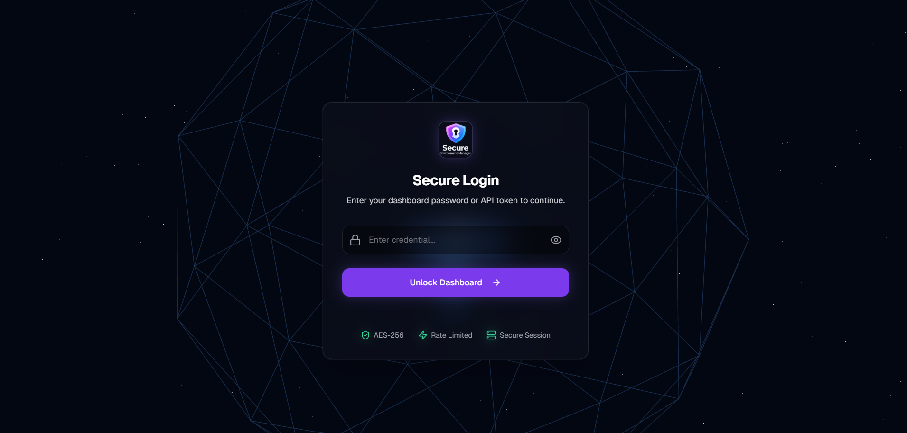
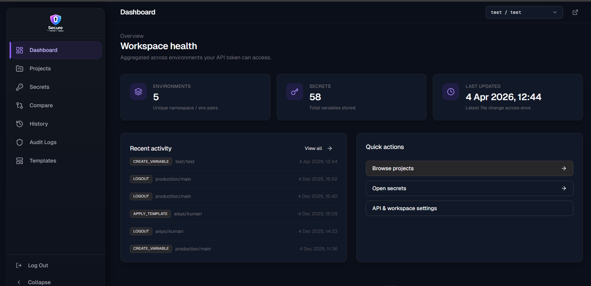
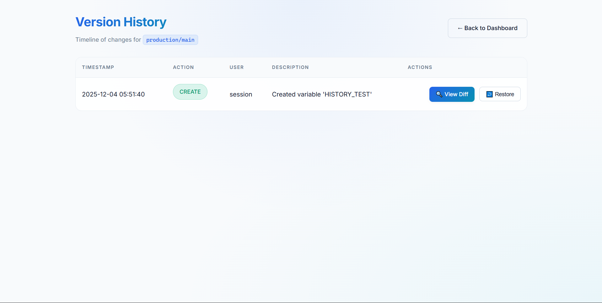
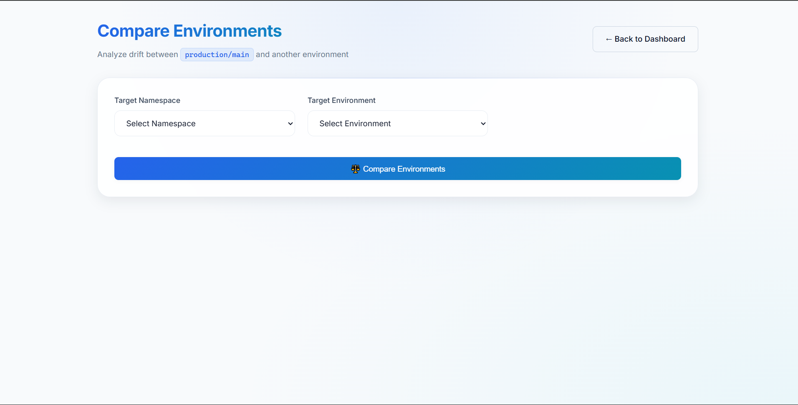
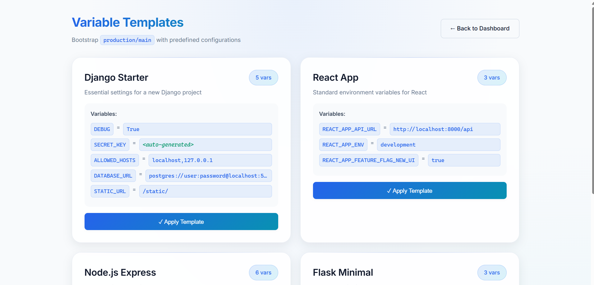
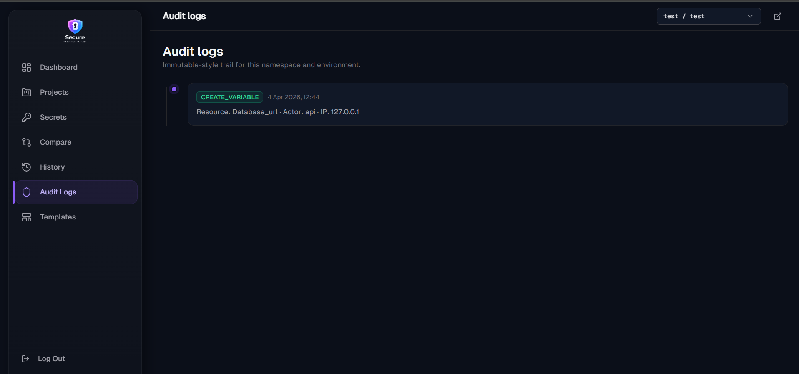

# 🔐 Secure Environment Manager

A powerful, secure web-based environment variable management system with encryption, version control, audit logging, and automated backups.

> **Advanced version of the original dotenv-server** - Enhanced with enterprise features including version control, environment comparison, variable templates, CLI tool, and automated email backups.
>
> Original project by [bugswriter.ai](https://github.com/bugswriter)

---

## 📸 Screenshots

### 🔐 Login Page

*Secure authentication for each environment namespace*

### 📊 Dashboard

*Clean interface for managing environment variables with search, add, edit, and delete capabilities*

### 🕰️ Version History

*Complete timeline of all changes with visual diff viewer and one-click rollback*

### ⚖️ Environment Comparison

*Side-by-side comparison of variables across different environments*

### 🧩 Variable Templates

*Pre-configured templates for Django, React, Node.js, Flask with auto-generated secrets*

### 🛡️ Audit Logs

*Complete security trail of all actions with filtering and export capabilities*

---

## ✨ Features

### 🔒 Core Security
- **AES-256 Encryption** - All variables encrypted at rest using Fernet
- **Password Protection** - Secure authentication for each environment
- **Audit Logging** - Complete trail of all changes and access
- **Session Management** - Secure session handling

### 📊 Environment Management
- **Multi-Environment Support** - Production, staging, development, etc.
- **Namespace Organization** - Group environments by project/team
- **Bulk Operations** - Import/export multiple variables at once
- **Search & Filter** - Quick variable lookup

### 🕰️ Version Control
- **Automatic History** - Every change tracked automatically
- **Visual Diff Viewer** - See exactly what changed
- **One-Click Rollback** - Restore previous versions instantly
- **Timeline View** - Complete change history

### 🔄 Advanced Features
- **Environment Comparison** - Compare variables across environments
- **Variable Templates** - Pre-configured setups for Django, React, Node.js, Flask
- **CLI Tool** - Command-line interface for automation
- **Email Backups** - Automated backups sent to email (daily/weekly/monthly)

### 📤 Export Formats
- `.env` files
- JSON
- YAML
- Direct download

---

## 🚀 Quick Start

### Prerequisites

- Python 3.8+
- pip

### Installation

1. **Clone the repository**
   ```bash
   git clone https://github.com/niranjansah87/Secure-Environment-Manager.git
   cd Secure-Environment-Manager
   ```

2. **Install dependencies**
   ```bash
   pip install -r requirements.txt
   ```

3. **Configure environment**
   
   Create a `.env` file in the root directory:
   ```bash
   # Required
   ADMIN_PASSWORD=your-secure-password
   ENCRYPTION_KEY=your-encryption-key-here
   DATA_DIR=./data
   
   # Optional: Email Backup
   SMTP_SERVER=smtp.gmail.com
1.  **Clone the repository**
    ```bash
    git clone https://github.com/niranjansah87/Secure-Environment-Manager.git
    cd Secure-Environment-Manager
    ```

2.  **Install dependencies**
    ```bash
    pip install -r requirements.txt
    ```

3.  **Configure environment**

    Create a `.env` file in the root directory:
    ```bash
    # Required
    ADMIN_PASSWORD=your-secure-password
    ENCRYPTION_KEY=your-encryption-key-here
    DATA_DIR=./data

    # Optional: Email Backup
    SMTP_SERVER=smtp.gmail.com
    SMTP_PORT=587
    SENDER_EMAIL=your-email@gmail.com
    SENDER_PASSWORD=your-app-password
    BACKUP_EMAIL=backup@example.com
    ```

    **Generate encryption key:**
    ```bash
    python scripts/generate_keys.py
    ```
    This will output a secure encryption key. Copy it for the next step.

4.  **Run the server**
    ```bash
    python app.py
    ```

5.  **Access the application**

    Open browser: `http://localhost:8070/production/main`

    Default password: `testpassword123` (change in `.env`)

---

## 📖 Usage Guide

### Web Interface

#### 1. **Login**
- Navigate to `http://localhost:8070/{namespace}/{environment}`
- Enter your password
- Access the dashboard

#### 2. **Manage Variables**
- **Add:** Click "Add Variable" button
- **Edit:** Click on variable value to edit inline
- **Delete:** Click trash icon
- **Search:** Use search box to filter variables

#### 3. **Bulk Operations**
- **Import:** Paste `.env` content and click "Bulk Replace"
- **Export:** Choose format (ENV/JSON/YAML) and download

#### 4. **Version History**
- Click 🕒 History icon
- View all changes with timestamps
- Compare versions with diff viewer
- Restore previous versions

#### 5. **Compare Environments**
- Click ⚖️ Compare icon
- Select target environment
- View side-by-side differences
- Identify unique and modified variables

#### 6. **Variable Templates**
- Click 🧩 Templates icon
- Browse pre-configured templates
- Apply template to current environment
- Auto-generates secure secrets

#### 7. **Audit Logs**
- Click 🛡️ Audit icon
- View complete security trail
- Filter by action, user, date
- Export logs for compliance

### CLI Tool

#### Installation
```bash
# Already included in the project
cd Secure-Environment-Manager
```

#### Usage

**List all variables:**
```bash
python scripts/dotenv-cli.py -n production -e main list
```

**Get specific variable:**
```bash
python scripts/dotenv-cli.py -n production -e main get DATABASE_URL
```

**Set variable:**
```bash
python scripts/dotenv-cli.py -n production -e main set API_KEY "secret-key"
```

**Delete variable:**
```bash
python scripts/dotenv-cli.py -n production -e main delete OLD_VAR
```

**Export to file:**
```bash
python scripts/dotenv-cli.py -n production -e main export -o backup.env
python scripts/dotenv-cli.py -n production -e main export --format json -o vars.json
```

**Import from file:**
```bash
python scripts/dotenv-cli.py -n production -e main import .env
```

### Email Backups

#### Setup

1.  **Configure email in `.env`:**
    ```bash
    SMTP_SERVER=smtp.gmail.com
    SMTP_PORT=587
    SENDER_EMAIL=your-email@gmail.com
    SENDER_PASSWORD=your-app-password  # Gmail App Password
    BACKUP_EMAIL=backup@example.com
    ```

2.  **For Gmail - Create App Password:**
    - Go to https://myaccount.google.com/apppasswords
    - Select "Mail" and "Other (Custom name)"
    - Copy the 16-character password
    - Use as `SENDER_PASSWORD`

3.  **Test backup:**
    ```bash
    python scripts/email_backup.py
    ```

4.  **Schedule automated backups:**

    **Windows Task Scheduler:**
    - See `docs/WINDOWS_SCHEDULER_GUIDE.md` for detailed steps
    - Quick: Run `scripts/run_backup.bat` daily at 2 AM

    **Linux/Mac Cron:**
    ```bash
    # Daily at 2 AM
    0 2 * * * cd /path/to/Secure-Environment-Manager && python scripts/email_backup.py
    ```

---

## 🏗️ Project Structure

```
Secure-Environment-Manager/
├── app.py                    # Main Flask application
├── audit_logger.py           # Audit logging functionality
├── history_manager.py        # Version history management
├── requirements.txt          # Python dependencies
├── .env                      # Configuration (not in git)
├── .env.example              # Example configuration template
├── api_keys.json            # API tokens (not in git)
├── templates_config.json    # Template configurations
├── data/                    # Encrypted environment files
│   └── <namespace>/
│       └── <environment>.enc
├── audit_logs/              # Audit log files (not in git)
├── scripts/                 # Utility scripts
│   ├── README.md            # Scripts documentation
│   ├── generate_keys.py     # Encryption key generator
│   ├── dotenv-cli.py        # CLI tool
│   ├── email_backup.py      # Email backup script
│   └── run_backup.bat       # Windows backup script
├── templates/               # HTML templates
│   ├── layout.html
│   ├── login.html
│   ├── dashboard.html
│   └── error.html
├── docs/                    # Documentation
│   ├── SETUP.md
│   ├── CLI_README.md
│   ├── BACKUP_GUIDE.md
│   ├── EMAIL_BACKUP_GUIDE.md
│   └── WINDOWS_SCHEDULER_GUIDE.md
├── nginx/                   # Nginx configuration
├── Dockerfile.prod          # Production Docker image
├── docker-compose.prod.yml  # Docker Compose config
├── Caddyfile                # Caddy reverse proxy config
└── dotenv.service           # Systemd service files
```

---

## 🔐 Security Best Practices

### Encryption Key
- **CRITICAL:** Store `ENCRYPTION_KEY` securely
- Without it, encrypted data is **unrecoverable**
- Store in:
  - Password manager (1Password, LastPass)
  - AWS Secrets Manager / Azure Key Vault
  - Physical safe (printed copy)

### Passwords
- Use strong, unique passwords for each environment
- Change default password immediately
- Use password manager

### Backups
- **3-2-1 Rule:** 3 copies, 2 storage types, 1 off-site
- Email backups include encryption key
- Secure your email account with 2FA
- Test restore process monthly

### Access Control
- Limit server access to trusted IPs
- Use HTTPS in production
- Enable audit logging
- Review logs regularly

---

## 📦 Backup & Recovery

### Automated Email Backups

**What's backed up:**
- ✅ All encrypted environment files (`data/`)
- ✅ Encryption key (`.env`)
- ✅ Audit logs (`audit_logs/`)
- ✅ Template configurations (`templates_config.json`)

**Schedule options:**
- Daily at 2 AM
- Weekly on Sundays
- Monthly on 1st
- Custom schedule

**Setup:** See `EMAIL_BACKUP_GUIDE.md` and `WINDOWS_SCHEDULER_GUIDE.md`

### Manual Backup

```bash
# Quick backup
tar -czf backup_$(date +%Y%m%d).tar.gz data/ .env audit_logs/

# Or use email backup
python email_backup.py
```

### Restore from Backup

1. **Stop server**
2. **Extract backup:**
   ```bash
   unzip dotenv_backup_YYYYMMDD_HHMMSS.zip
   ```
3. **Restore files:**
   ```bash
   cp -r data ./
   cp .env ./
   ```
4. **Restart server**

---

## 🛠️ Configuration

### Environment Variables

| Variable | Required | Default | Description |
|----------|----------|---------|-------------|
| `ADMIN_PASSWORD` | Yes | - | Master password for authentication |
| `ENCRYPTION_KEY` | Yes | - | Fernet encryption key |
| `DATA_DIR` | No | `./data` | Directory for encrypted files |
| `SMTP_SERVER` | No | - | SMTP server for email backups |
| `SMTP_PORT` | No | `587` | SMTP port |
| `SENDER_EMAIL` | No | - | Email address for sending backups |
| `SENDER_PASSWORD` | No | - | Email password (app password) |
| `BACKUP_EMAIL` | No | - | Email address to receive backups |
| `BACKUP_DIR` | No | `./backups` | Local backup directory |

### Variable Templates

Edit `templates_config.json` to add custom templates:

```json
{
  "my_template": {
    "name": "My Custom Template",
    "description": "Custom configuration",
    "variables": {
      "VAR_NAME": "value",
      "SECRET_KEY": "__GENERATE__"
    }
  }
}
```

Use `__GENERATE__` for auto-generated secure secrets.

---

## 🐛 Troubleshooting

### Server won't start

**Check encryption key:**
```python
python -c "from cryptography.fernet import Fernet; import os; from dotenv import load_dotenv; load_dotenv(); print('Key valid!' if os.getenv('ENCRYPTION_KEY') else 'Key missing!')"
```

**Check dependencies:**
```bash
pip install -r requirements.txt
```

### Can't decrypt data

- Verify `ENCRYPTION_KEY` matches the one used to encrypt
- Check `.env` file exists and is loaded
- Ensure no whitespace in encryption key

### Email backups not working

- Verify email credentials in `.env`
- For Gmail, use App Password (not regular password)
- Check SMTP server and port
- Test manually: `python email_backup.py`

### History not showing

- Check `data/{namespace}/{environment}.history.jsonl` exists
- Verify file permissions
- Check server logs for errors

---

## 📊 API Endpoints

| Endpoint | Method | Description |
|----------|--------|-------------|
| `/{namespace}/{environment}` | GET/POST | Login and dashboard |
| `/add/{namespace}/{environment}` | POST | Add/update variable |
| `/delete/{namespace}/{environment}` | POST | Delete variable |
| `/bulk-replace/{namespace}/{environment}` | POST | Bulk import |
| `/download/{namespace}/{environment}/{format}` | GET | Export variables |
| `/history/{namespace}/{environment}` | GET | View history |
| `/compare/{namespace}/{environment}` | GET | Compare versions |
| `/rollback/{namespace}/{environment}/{id}` | POST | Rollback to version |
| `/compare-environments/{namespace}/{environment}` | GET/POST | Compare environments |
| `/templates/{namespace}/{environment}` | GET | View templates |
| `/templates/{namespace}/{environment}/apply` | POST | Apply template |
| `/audit-logs/{namespace}/{environment}` | GET | View audit logs |

---

## 🚀 Production Deployment

### Using Gunicorn (Recommended)

```bash
gunicorn -w 4 -b 0.0.0.0:8070 app:app
```

### Using systemd (Linux)

Create `/etc/systemd/system/dotenv-server.service`:

```ini
[Unit]
Description=Dotenv Server
After=network.target

[Service]
Type=simple
User=your-user
WorkingDirectory=/path/to/Secure-Environment-Manager
Environment="PATH=/path/to/venv/bin"
ExecStart=/path/to/venv/bin/gunicorn -w 4 -b 0.0.0.0:8070 app:app
Restart=always

[Install]
WantedBy=multi-user.target
```

Enable and start:
```bash
sudo systemctl enable dotenv-server
sudo systemctl start dotenv-server
```

### Using Docker

```dockerfile
FROM python:3.11-slim
WORKDIR /app
COPY requirements.txt .
RUN pip install -r requirements.txt
COPY . .
EXPOSE 8070
CMD ["gunicorn", "-w", "4", "-b", "0.0.0.0:8070", "app:app"]
```

Build and run:
```bash
docker build -t dotenv-server .
docker run -d -p 8070:8070 -v $(pwd)/data:/app/data -v $(pwd)/.env:/app/.env dotenv-server
```

---

## 🤝 Contributing

Contributions are welcome! Please:

1. Fork the repository
2. Create a feature branch
3. Make your changes
4. Submit a pull request

---

## 📄 License

This project is an enhanced version of the original dotenv-server.

**Credits:**
- Original project: [bugswriter.ai](https://github.com/bugswriter)
- Advanced features: Enhanced version with enterprise capabilities

---

## 🆘 Support

For issues, questions, or feature requests:

1. Check existing documentation
2. Review troubleshooting section
3. Check server logs
4. Create an issue with details

---

## 🎯 Roadmap

### Completed ✅
- ✅ Version control with history
- ✅ Environment comparison
- ✅ Variable templates
- ✅ CLI tool
- ✅ Email backups
- ✅ Audit logging

### Planned 🚧
- 🚧 Secrets rotation
- 🚧 API key authentication
- 🚧 Email notifications
- 🚧 Database migration (PostgreSQL)
- 🚧 Redis caching
- 🚧 Monitoring (Prometheus/Grafana)

---

## 📚 Additional Documentation

- **Email Backup Setup:** `EMAIL_BACKUP_GUIDE.md`
- **Windows Scheduling:** `WINDOWS_SCHEDULER_GUIDE.md`
- **Setup Guide:** `SETUP.md`

---

**Made with ❤️ for secure environment management**
