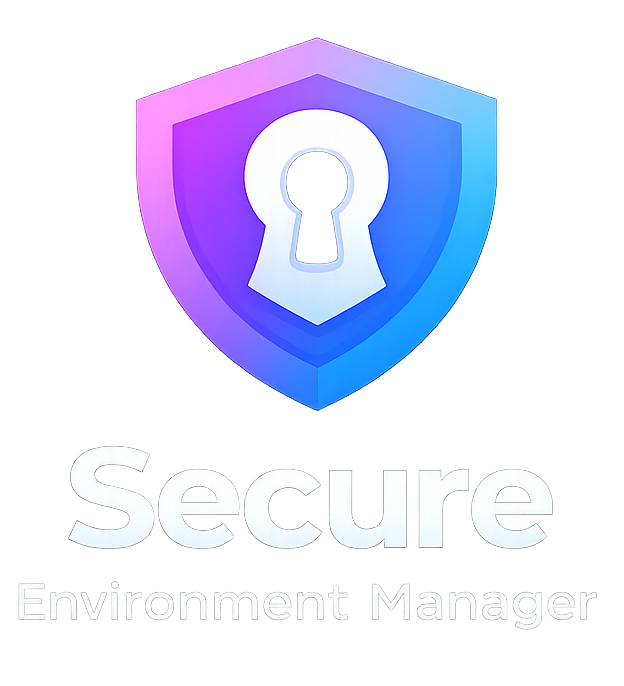
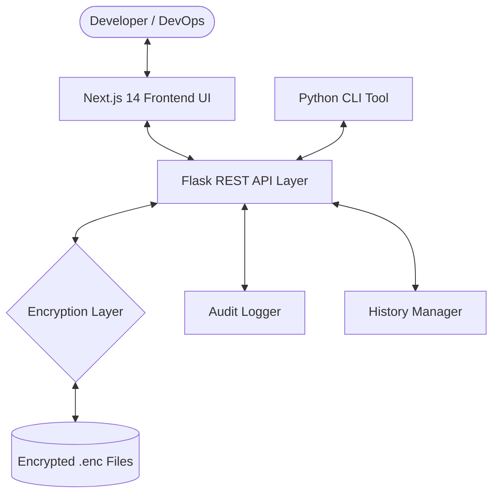

<div align="center">



# 🔐 Secure Environment Manager

**The professional, open-source vault for your environment variables. Fully encrypted, audit-ready, and developer-obsessed.**

[](LICENSE)
[](https://github.com/niranjansah87/Secure-Environment-Manager/stargazers)
[](https://github.com/niranjansah87/Secure-Environment-Manager/network)
[](https://github.com/niranjansah87/Secure-Environment-Manager/issues)
[](https://github.com/niranjansah87/Secure-Environment-Manager/commits/main)

[Features](#-features) • [Quick Start](#-quick-start) • [Architecture](#-architecture) • [Security](#-security-highlights)

</div>

---

## 📸 Screenshots

<details>
<summary>Click to preview the modern Next.js interface</summary>

### 🏠 Home Page


### 🔐 Secure Login


### 📊 Dashboard & Stats


### 🕵️ Secrets Management


### 📜 Audit Logs


</details>

---

## 🚀 Why Secure Environment Manager?

Managing `.env` files manually is a security nightmare and an operational headache. **Secure Environment Manager** solves this by providing a centralized, encrypted, and audit-ready platform for all your secrets.

*   **Stop Secrets Sprawl**: Centralize all your environment variables in one secure vault.
*   **Beyond .env Files**: No more sharing plain-text secrets over Slack or Email.
*   **Audit Everything**: Know exactly who changed what and when with detailed audit trails.
*   **Safe Rollbacks**: Messed up a config? Roll back to any previous version instantly.
*   **Platform Independent**: Works for React, Node, Python, PHP, or any stack you use.

---

## ✨ Features

### 🔒 Security & Protection
- **AES-256 Encryption**: All secrets are encrypted at rest using industry-standard Fernet encryption.
- **Audit Logging**: Comprehensive trail of every access, modification, or deletion with user tracking.
- **Bearer Token Auth**: Secure API access with granular, per-namespace tokens.
- **Secret Isolation**: Organize variables into namespaces and environments for strict isolation.
- **RBAC for API Keys**: Admin-controlled API keys with optional expiry dates, custom key support, and namespace-scoped access.

### 📊 Advanced Management
- **Next.js 14 Web UI**: A sleek, high-performance interface for managing your secrets.
- **Environment Comparison**: Instantly detect drift between production, staging, and development.
- **Bulk Operations**: Import or export `.env`, JSON, or YAML in seconds.
- **Variable Templates**: Quick-start templates for Django, React, Express, Flask, and more.
- **API Key Management**: Create, view, and revoke API keys with full audit trail. Keys can be bound to specific namespaces and have optional validity periods.

### 🕰️ Versioning & Automation
- **Snapshots & History**: Every change creates a versioned snapshot automatically.
- **One-Click Rollback**: Restore your environment to any previous state from the UI.
- **CLI Tool**: A powerful Python CLI for CI/CD pipelines and local automation.
- **Automated Backups**: Schedule daily/weekly encrypted backups sent directly to your email.

---

## 🏗️ Architecture

Secure Environment Manager is built with a clear separation of concerns, ensuring high security and a seamless developer experience.


```mermaid
graph TD
    User([Developer / DevOps]) <--> Frontend[Next.js 14 Frontend UI]
    Frontend <--> API[Flask REST API Layer]
    API <--> Enc{Encryption Layer}
    Enc <--> Storage[(Encrypted .enc Files)]
    API <--> Audit[Audit Logger]
    API <--> History[History Manager]
    CLI[Python CLI Tool] <--> API
```

*   **Frontend**: Next.js 14 (App Router) + TypeScript + Tailwind + shadcn/ui
*   **Backend**: Flask API server acting as the secure encryption and logic gate.
*   **Encryption**: Fernet symmetric encryption ensures data is unreadable without the `ENCRYPTION_KEY`.
*   **Persistence**: Secure file-based storage for high portability and easy backups.

---

## 🛠️ Tech Stack

### Frontend
- **Framework**: [Next.js 14](https://nextjs.org/)
- **Styling**: [Tailwind CSS](https://tailwindcss.com/)
- **Components**: [shadcn/ui](https://ui.shadcn.com/)
- **State Management**: React Query / TanStack Table

### Backend
- **Framework**: [Flask (Python)](https://flask.palletsprojects.com/)
- **Security**: [Cryptography.io](https://cryptography.io/)
- **Logs**: Standard Audit Trail + Versioned History

### DevOps
- **Containerization**: [Docker](https://www.docker.com/) & Docker Compose
- **Web Server**: Gunicorn / Nginx / Caddy
- **Automation**: Python-based CLI and Email Backup Service

---

## 🔐 Security Highlights

> [!IMPORTANT]
> **CRITICAL:** Your `ENCRYPTION_KEY` is the master key to your data. If lost, your secrets are unrecoverable. Store it in a secure password manager or hardware vault.

*   **Encryption at Rest**: We use AES-256-CBC via the Fernet protocol. No plain-text secrets ever touch the disk.
*   **Accountability**: Every action (create, update, delete, view) is logged with a timestamp, IP, and user context.
*   **API Security**: Each namespace has its own Bearer token, ensuring one team cannot access another's secrets.
*   **RBAC API Keys**: Admin-managed API keys with configurable validity, custom key support, and namespace binding.
*   **Zero Dependencies on Databases**: By using secure file-based storage, we eliminate database-level attack vectors and simplify migration.

---

## ⚡ Quick Start

### 1. Clone & Install
```bash
git clone https://github.com/niranjansah87/Secure-Environment-Manager.git
cd Secure-Environment-Manager
pip install -r requirements.txt
```

### 2. Configure Environment
Create a `.env` file in the root (see `.env.example`):
```bash
FLASK_SECRET_KEY=your-flask-secret
ENCRYPTION_KEY=your-fernet-key # Generate with scripts/generate_keys.py
DASHBOARD_PASSWORD=your-secure-password
```

### 3. Start the Engines
**Run the API (Flask):**
```bash
python app.py
```

**Run the UI (Next.js):**
```bash
cd frontend
npm install
npm run dev
```

Visit [http://localhost:3000](http://localhost:3000) and start managing your secrets!

---

## 🔑 API Key Management

API keys provide programmatic access to the Secure Environment Manager API. Keys are managed by administrators (master token or dashboard password) and can be scoped to specific namespaces.

### Creating an API Key
```bash
curl -X POST http://localhost:8070/api/v1/keys/{namespace} \
  -H "Authorization: Bearer YOUR_ADMIN_TOKEN" \
  -H "Content-Type: application/json" \
  -d '{
    "description": "CI/CD Pipeline Key",
    "validity_days": 90,
    "namespaces": ["production", "staging"],
    "custom_key": "my_custom_key_16chars_min"
  }'
```

### API Key Response
```json
{
  "key": "my_custom_key_16chars_min",
  "key_id": "a1b2c3d4e5f6g7h8",
  "namespace": "production",
  "description": "CI/CD Pipeline Key",
  "validity_days": 90,
  "expires_at": "2026-08-12T12:00:00+00:00",
  "namespaces": ["production", "staging"],
  "message": "Store this key securely. It will not be shown again."
}
```

### Key Features
- **Validity Period**: 7, 30, 60, 90, 180, 365 days or no expiry
- **Custom Keys**: Provide your own key (16-64 chars, alphanumeric + underscore/hyphen)
- **Namespace Binding**: Grant access to specific namespaces (empty = all namespaces)
- **Full Audit Trail**: Every key operation is logged with timestamp and admin identity

### Managing Keys
| Endpoint | Method | Description |
|----------|--------|-------------|
| `/api/v1/keys/{namespace}` | GET | List all API keys for a namespace |
| `/api/v1/keys/{namespace}` | POST | Create a new API key |
| `/api/v1/keys/{namespace}/{key_id}` | GET | Get key details |
| `/api/v1/keys/{namespace}/{key_id}` | DELETE | Revoke a key |

---

## 📚 Documentation

For detailed guides and deep-dives, please check our documentation:

*   **[Setup Instructions](file:///c:/Secure-Enviornment-Manager/docs/SETUP.md)**: Comprehensive guide to getting started.
*   **[Monitoring Guide](file:///c:/Secure-Enviornment-Manager/docs/MONITORING.md)**: Details on Prometheus and Grafana integration.
*   **[Local Monitoring Setup](file:///c:/Secure-Enviornment-Manager/docs/LOCAL_MONITORING_SETUP.md)**: Manual guide (No Docker).
*   **[Backup & Recovery](file:///c:/Secure-Enviornment-Manager/docs/BACKUP_GUIDE.md)**: Safeguarding your encrypted data.
*   **[Security Policy](SECURITY.md)**: How we handle security and vulnerability reporting.
*   **[Branch Protection](file:///c:/Secure-Enviornment-Manager/docs/branch_protection_guide.md)**: Best practices for production stability.

---

## 🤝 Contributing

We love contributions! Whether it's fixing a bug, adding a feature, or improving documentation:

1.  Fork the Project
2.  Create your Feature Branch (`git checkout -b feature/AmazingFeature`)
3.  Commit your Changes (`git commit -m 'Add some AmazingFeature'`)
4.  Push to the Branch (`git push origin feature/AmazingFeature`)
5.  Open a Pull Request

See [CONTRIBUTING.md](CONTRIBUTING.md) for more details.

---

## 📄 License

Distributed under the **MIT License**. See `LICENSE` for more information.

---

## 🆘 Support

*   **Issues**: [GitHub Issue Tracker](https://github.com/niranjansah87/Secure-Environment-Manager/issues)
*   **Security**: See [SECURITY.md](SECURITY.md)
*   **Author**: [Niranjan Sah](https://github.com/niranjansah87)

---

<p align="center">
  <b>Built for developers who care about security.</b><br>
  ⭐️ If this project helped you, give it a star on GitHub!
</p>
