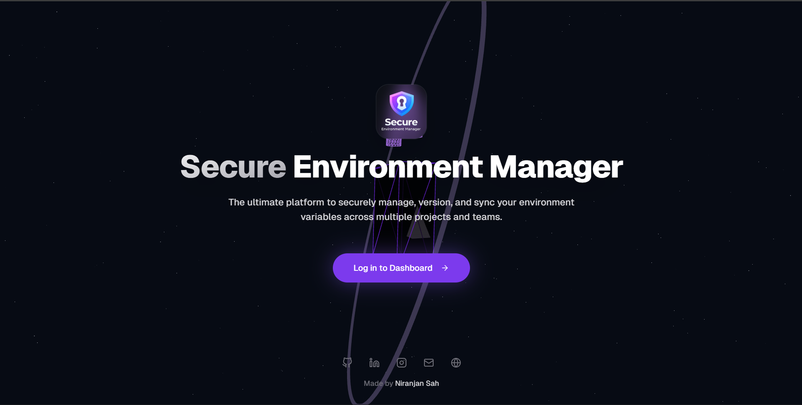
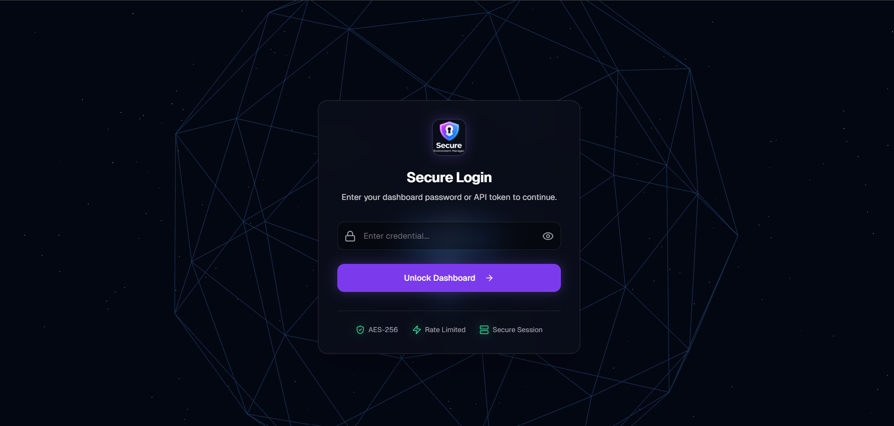
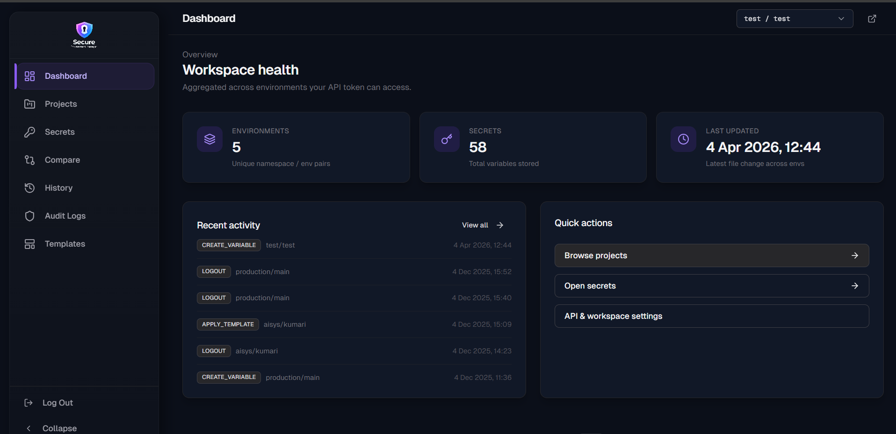
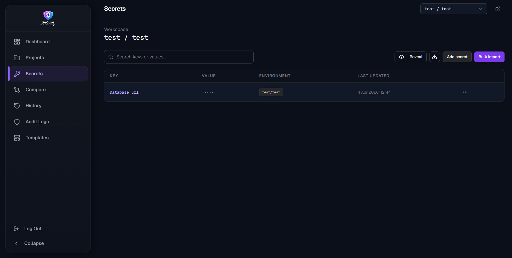
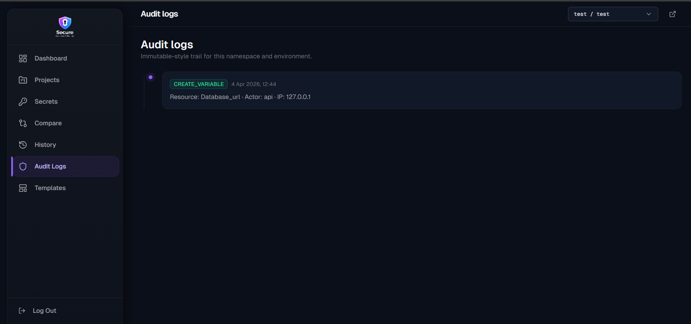

# 🔐 Secure Environment Manager

A powerful, secure web-based environment variable management system with encryption, version control, audit logging, and automated backups.

> **Advanced version of the original dotenv-server** - Enhanced with enterprise features including version control, environment comparison, variable templates, CLI tool, and automated email backups.

---

## 📸 Screenshots

<details>
<summary>Click to view screenshots of the web UI</summary>

### Home Page


### Login


### Dashboard


### Secrets Management


### Audit Logs


</details>

---

## 🖥️ Web UI (Next.js)

The primary interface is a **Next.js 14** app under `frontend/` (App Router, TypeScript, Tailwind, shadcn-style components, TanStack Table). The Flask server remains the **API and encryption layer**; legacy Jinja/HTML templates have been removed—browser visits to old paths redirect to the SPA.

**Branding:** replace `frontend/public/logo.svg` and `frontend/src/app/icon.svg` with your own logo and favicon if you use different assets.

### Next.js routes (implemented)

| Route | Purpose |
|--------|---------|
| `/dashboard` | Stats, recent activity, quick actions |
| `/projects` | Grid of namespaces/environments |
| `/settings` | API base URL display, Bearer token (localStorage) |
| `/{namespace}/{environment}` | Secrets table (mask/reveal, CRUD, bulk import) |
| `/{namespace}/{environment}/compare` | Compare two environments (client-side diff) |
| `/{namespace}/{environment}/history` | Timeline + restore snapshot |
| `/{namespace}/{environment}/audit` | Audit timeline |
| `/{namespace}/{environment}/templates` | Template cards + apply |

**Not in the SPA (use API or History):** per-snapshot **visual diff** page (old `diff.html`). Rollback and history are available from **History** on the Next app.

### Run the UI locally

```bash
cd frontend
cp .env.local.example .env.local   # set NEXT_PUBLIC_API_URL if Flask is not on localhost:8070
npm install
npm run dev
```

Open [http://localhost:3000](http://localhost:3000). In **Settings**, paste a Bearer token from `api_keys.json` for that namespace, or set `MASTER_API_TOKEN` on Flask for full visibility.

---

## ✨ Features

### 🔒 Core Security
- **AES-256 Encryption** - All variables encrypted at rest using Fernet
- **Dashboard password** (`DASHBOARD_PASSWORD`) - Legacy **session** auth for form/CLI flows against Flask (optional if you only use the Next UI + Bearer API)
- **Bearer API** - `api_keys.json` per namespace; optional `MASTER_API_TOKEN` for admin-style API access
- **Audit Logging** - Complete trail of all changes and access
- **Session Management** - Flask session for legacy POST routes (add/delete/bulk/export)

### 📊 Environment Management
- **Multi-Environment Support** - Production, staging, development, etc.
- **Namespace Organization** - Group environments by project/team
- **Bulk Operations** - Import/export multiple variables at once
- **Search & Filter** - Quick variable lookup

### 🕰️ Version Control
- **Automatic History** - Every change tracked automatically
- **Rollback** - Restore previous versions from the Next.js **History** page (or API)
- **Timeline View** - Complete change history in the SPA
- **Snapshot diff (legacy HTML)** - Removed with Jinja templates; use History + Compare for drift

### 🔄 Advanced Features
- **Environment Comparison** - Compare variables across environments
- **Variable Templates** - Pre-configured setups for Django, React, Node.js, Flask
- **CLI Tool** - Command-line interface for automation
- **Email Backups** - Automated backups sent to email (daily/weekly/monthly)

### 📤 Export Formats
- `.env` files
- JSON
- YAML
- Direct download

---

## 🚀 Quick Start

### Prerequisites

- Python 3.8+
- pip

### Installation

1. **Clone the repository**
   ```bash
   git clone https://github.com/niranjansah87/Secure-Environment-Manager.git
   cd Secure-Environment-Manager
   ```

2. **Install dependencies**
   ```bash
   pip install -r requirements.txt
   ```

3. **Configure environment**

   Create a `.env` file in the repository root (see `.env.example`):
   ```bash
   # Required for Flask
   FLASK_SECRET_KEY=your-random-secret
   ENCRYPTION_KEY=your-fernet-key
   DASHBOARD_PASSWORD=your-secure-password
   DATA_DIR=./data

   # Next.js + browser API (local dev)
   CORS_ORIGINS=http://localhost:3000
   FRONTEND_URL=http://localhost:3000

   # Optional: master Bearer for API (see docs in .env.example)
   # MASTER_API_TOKEN=

   # Optional: Email backup
   # SMTP_SERVER=smtp.gmail.com
   # SMTP_PORT=587
   # SENDER_EMAIL=...
   # SENDER_PASSWORD=...
   # BACKUP_EMAIL=...
   ```

   **Generate encryption key:**
   ```bash
   python scripts/generate_keys.py
   ```

4. **Run the API (Flask)**

   ```bash
   python app.py
   ```

   API listens on **http://localhost:8070** by default. Visiting `http://localhost:8070/{namespace}/{environment}` redirects to the Next.js app (`FRONTEND_URL`).

5. **Run the web UI (Next.js)**

   ```bash
   cd frontend
   npm install
   npm run dev
   ```

   Open **http://localhost:3000**. Add a Bearer token under **Settings** (from `api_keys.json` for that namespace, or `MASTER_API_TOKEN`).

---

## 📖 Usage Guide

### Web interface (Next.js)

Use the sidebar: **Dashboard**, **Projects**, **Secrets**, **Compare**, **History**, **Audit Logs**, **Templates**, **Settings**. Secrets support masked values, search, add/edit dialog, bulk import with preview, and delete confirmation. **History** supports restore (rollback) via the API.

Legacy **Flask session password** (`DASHBOARD_PASSWORD`) is only needed if you still use old form POST routes or tools that POST a password to `/{namespace}/{environment}`.

**Exports:** from the API or legacy authenticated GET routes (`/download/...`, `/export/.../json`, `/export/.../yaml`).

### CLI Tool

#### Installation
```bash
# Already included in the project
cd Secure-Environment-Manager
```

#### Usage

**List all variables:**
```bash
python scripts/dotenv-cli.py -n production -e main list
```

**Get specific variable:**
```bash
python scripts/dotenv-cli.py -n production -e main get DATABASE_URL
```

**Set variable:**
```bash
python scripts/dotenv-cli.py -n production -e main set API_KEY "secret-key"
```

**Delete variable:**
```bash
python scripts/dotenv-cli.py -n production -e main delete OLD_VAR
```

**Export to file:**
```bash
python scripts/dotenv-cli.py -n production -e main export -o backup.env
python scripts/dotenv-cli.py -n production -e main export --format json -o vars.json
```

**Import from file:**
```bash
python scripts/dotenv-cli.py -n production -e main import .env
```

### Email Backups

#### Setup

1.  **Configure email in `.env`:**
    ```bash
    SMTP_SERVER=smtp.gmail.com
    SMTP_PORT=587
    SENDER_EMAIL=your-email@gmail.com
    SENDER_PASSWORD=your-app-password  # Gmail App Password
    BACKUP_EMAIL=backup@example.com
    ```

2.  **For Gmail - Create App Password:**
    - Go to https://myaccount.google.com/apppasswords
    - Select "Mail" and "Other (Custom name)"
    - Copy the 16-character password
    - Use as `SENDER_PASSWORD`

3.  **Test backup:**
    ```bash
    python scripts/email_backup.py
    ```

4.  **Schedule automated backups:**

    **Windows Task Scheduler:**
    - See `docs/WINDOWS_SCHEDULER_GUIDE.md` for detailed steps
    - Quick: Run `scripts/run_backup.bat` daily at 2 AM

    **Linux/Mac Cron:**
    ```bash
    # Daily at 2 AM
    0 2 * * * cd /path/to/Secure-Environment-Manager && python scripts/email_backup.py
    ```

---

## 🏗️ Project Structure

```
Secure-Environment-Manager/
├── app.py                    # Flask API + legacy form routes (redirect to Next.js)
├── audit_logger.py           # Audit logging functionality
├── history_manager.py        # Version history management
├── requirements.txt          # Python dependencies
├── .env                      # Configuration (not in git)
├── .env.example              # Example configuration template
├── api_keys.json             # API Bearer tokens per namespace (not in git)
├── templates_config.json     # Variable templates (used by API + Next.js)
├── frontend/                 # Next.js 14 web UI
│   ├── src/app/              # App Router pages + icon.svg (favicon)
│   ├── public/logo.svg       # Sidebar / metadata logo (replace with yours)
│   └── package.json
├── data/                     # Encrypted environment files
│   └── <namespace>/
│       └── <environment>.enc
├── audit_logs/               # Audit log files (not in git)
├── scripts/                  # Utility scripts
│   ├── generate_keys.py
│   ├── dotenv-cli.py
│   ├── email_backup.py
│   └── run_backup.bat
├── docs/
├── nginx/
├── Dockerfile.prod
├── docker-compose.prod.yml
├── Caddyfile
└── dotenv.service
```

---

## 🔐 Security Best Practices

### Encryption Key
- **CRITICAL:** Store `ENCRYPTION_KEY` securely
- Without it, encrypted data is **unrecoverable**
- Store in:
  - Password manager (1Password, LastPass)
  - AWS Secrets Manager / Azure Key Vault
  - Physical safe (printed copy)

### Passwords
- Use strong, unique passwords for each environment
- Change default password immediately
- Use password manager

### Backups
- **3-2-1 Rule:** 3 copies, 2 storage types, 1 off-site
- Email backups include encryption key
- Secure your email account with 2FA
- Test restore process monthly

### Access Control
- Limit server access to trusted IPs
- Use HTTPS in production
- Enable audit logging
- Review logs regularly

---

## 📦 Backup & Recovery

### Automated Email Backups

**What's backed up:**
- ✅ All encrypted environment files (`data/`)
- ✅ Encryption key (`.env`)
- ✅ Audit logs (`audit_logs/`)
- ✅ Template configurations (`templates_config.json`)

**Schedule options:**
- Daily at 2 AM
- Weekly on Sundays
- Monthly on 1st
- Custom schedule

**Setup:** See `EMAIL_BACKUP_GUIDE.md` and `WINDOWS_SCHEDULER_GUIDE.md`

### Manual Backup

```bash
# Quick backup
tar -czf backup_$(date +%Y%m%d).tar.gz data/ .env audit_logs/

# Or use email backup
python email_backup.py
```

### Restore from Backup

1. **Stop server**
2. **Extract backup:**
   ```bash
   unzip dotenv_backup_YYYYMMDD_HHMMSS.zip
   ```
3. **Restore files:**
   ```bash
   cp -r data ./
   cp .env ./
   ```
4. **Restart server**

---

## 🛠️ Configuration

### Environment Variables

| Variable | Required | Default | Description |
|----------|----------|---------|-------------|
| `FLASK_SECRET_KEY` | Yes | - | Flask session signing secret |
| `ENCRYPTION_KEY` | Yes | - | Fernet encryption key |
| `DASHBOARD_PASSWORD` | Yes | - | Password for legacy session login (form/CLI POST) |
| `DATA_DIR` | No | `./data` | Directory for encrypted files |
| `FRONTEND_URL` | No | `http://localhost:3000` | Next.js origin for redirects from Flask |
| `CORS_ORIGINS` | No | `http://localhost:3000` | Allowed browser origins for `/api/v1` |
| `MASTER_API_TOKEN` | No | - | Optional Bearer with access to all namespaces via API |
| `API_KEYS_FILE` | No | `api_keys.json` | Per-namespace API Bearer tokens |
| `SMTP_SERVER` | No | - | SMTP server for email backups |
| `SMTP_PORT` | No | `587` | SMTP port |
| `SENDER_EMAIL` | No | - | Email address for sending backups |
| `SENDER_PASSWORD` | No | - | Email password (app password) |
| `BACKUP_EMAIL` | No | - | Email address to receive backups |
| `BACKUP_DIR` | No | `./backups` | Local backup directory |

### Variable Templates

Edit `templates_config.json` to add custom templates:

```json
{
  "my_template": {
    "name": "My Custom Template",
    "description": "Custom configuration",
    "variables": {
      "VAR_NAME": "value",
      "SECRET_KEY": "__GENERATE__"
    }
  }
}
```

Use `__GENERATE__` for auto-generated secure secrets.

---

## 🐛 Troubleshooting

### Server won't start

**Check encryption key:**
```python
python -c "from cryptography.fernet import Fernet; import os; from dotenv import load_dotenv; load_dotenv(); print('Key valid!' if os.getenv('ENCRYPTION_KEY') else 'Key missing!')"
```

**Check dependencies:**
```bash
pip install -r requirements.txt
```

### Can't decrypt data

- Verify `ENCRYPTION_KEY` matches the one used to encrypt
- Check `.env` file exists and is loaded
- Ensure no whitespace in encryption key

### Email backups not working

- Verify email credentials in `.env`
- For Gmail, use App Password (not regular password)
- Check SMTP server and port
- Test manually: `python email_backup.py`

### History not showing

- Check `data/{namespace}/{environment}.history.jsonl` exists
- Verify file permissions
- Check server logs for errors

---

## 📊 API Endpoints

### JSON API (`/api/v1/...`, Bearer token)

| Endpoint | Method | Description |
|----------|--------|-------------|
| `/api/v1/meta/environments` | GET | List namespaces/environments visible to the token |
| `/api/v1/meta/stats` | GET | Aggregate stats + recent audit lines |
| `/api/v1/<namespace>/<environment>` | GET | Get all variables (JSON object) |
| `/api/v1/<namespace>/<environment>` | PUT/PATCH | Replace or merge variables |
| `/api/v1/<namespace>/<environment>/meta` | GET | `last_updated`, `variable_count` |
| `/api/v1/<namespace>/<environment>/keys/<key>` | DELETE | Delete one key |
| `/api/v1/<namespace>/<environment>/bulk` | POST | JSON `{ "payload": ".env text" }` full replace |
| `/api/v1/<namespace>/<environment>/history` | GET | History entries |
| `/api/v1/<namespace>/<environment>/audit` | GET | Audit entries |
| `/api/v1/<namespace>/<environment>/rollback` | POST | JSON `{ "snapshot_id" }` |
| `/api/v1/templates` | GET | Template definitions |
| `/api/v1/<namespace>/<environment>/templates/apply` | POST | JSON `{ "template_key" }` |

### Legacy browser paths (redirect to Next.js)

These require Flask **session** auth where noted; they **302** to `FRONTEND_URL` (default `http://localhost:3000`).

| Path | Notes |
|------|--------|
| `GET /{namespace}/{environment}` | Redirects to SPA workspace |
| `POST /{namespace}/{environment}` | Password login (legacy CLI); then redirect to SPA |
| `/history/...`, `/audit-logs/...`, `/templates/...`, `/compare-environments/...` | Redirect to matching SPA route |
| `/add/...`, `/delete/...`, `/bulk/...`, `/download/...`, `/export/...` | Still accept form/session clients |

See `.env.example` for `CORS_ORIGINS`, `FRONTEND_URL`, `MASTER_API_TOKEN`.

---

## 🚀 Production Deployment

### Using Gunicorn (Recommended)

```bash
gunicorn -w 4 -b 0.0.0.0:8070 app:app
```

### Using systemd (Linux)

Create `/etc/systemd/system/dotenv-server.service`:

```ini
[Unit]
Description=Dotenv Server
After=network.target

[Service]
Type=simple
User=your-user
WorkingDirectory=/path/to/Secure-Environment-Manager
Environment="PATH=/path/to/venv/bin"
ExecStart=/path/to/venv/bin/gunicorn -w 4 -b 0.0.0.0:8070 app:app
Restart=always

[Install]
WantedBy=multi-user.target
```

Enable and start:
```bash
sudo systemctl enable dotenv-server
sudo systemctl start dotenv-server
```

### Using Docker

```dockerfile
FROM python:3.11-slim
WORKDIR /app
COPY requirements.txt .
RUN pip install -r requirements.txt
COPY . .
EXPOSE 8070
CMD ["gunicorn", "-w", "4", "-b", "0.0.0.0:8070", "app:app"]
```

Build and run:
```bash
docker build -t dotenv-server .
docker run -d -p 8070:8070 -v $(pwd)/data:/app/data -v $(pwd)/.env:/app/.env dotenv-server
```

---

## 🤝 Contributing

Contributions are welcome! Please:

1. Fork the repository
2. Create a feature branch
3. Make your changes
4. Submit a pull request

---

## 📄 License

This project is the Secure Environment Manager, featuring enterprise capabilities like audit logging, Next.js frontend, multi-tenancy, and high-performance caching.

---

## 🆘 Support

For issues, questions, or feature requests:

1. Check existing documentation
2. Review troubleshooting section
3. Check server logs
4. Create an issue with details

---

## 🎯 Roadmap

### Completed ✅
- ✅ Version control with history
- ✅ Environment comparison (Next.js Compare page + API)
- ✅ Variable templates
- ✅ Next.js production-style web UI
- ✅ Extended JSON API (`/api/v1`)
- ✅ CLI tool (see `docs/CLI_README.md`; paths may need updating for `/api/v1`)
- ✅ Email backups
- ✅ Audit logging

### Planned 🚧
- 🚧 Secrets rotation
- 🚧 API key authentication
- 🚧 Email notifications
- 🚧 Database migration (PostgreSQL)
- 🚧 Redis caching
- 🚧 Monitoring (Prometheus/Grafana)

---

## 📚 Additional Documentation

- **Email Backup Setup:** `EMAIL_BACKUP_GUIDE.md`
- **Windows Scheduling:** `WINDOWS_SCHEDULER_GUIDE.md`
- **Setup Guide:** `SETUP.md`

---

**Made with ❤️ for secure environment management**
