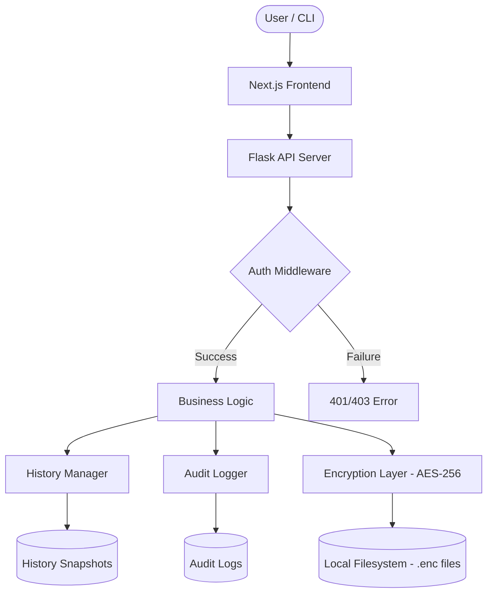

# Architecture

Secure Environment Manager (SEM) is built as a high-performance, self-hosted web application with a modular design to ensure scalability, security, and easy maintenance.

## System Components

The SEM ecosystem consists of four main layers:

1.  **Frontend (Next.js)**: A React-based Single Page Application (SPA) providing a modern, responsive UI. It communicates with the backend via a REST API.
2.  **Backend (Flask)**: A Python-powered API server that handles business logic, authentication, and communication with the storage layer.
3.  **Security Layer (Fernet)**: A middleware that encrypts data before it reaches the disk and decrypts it only when requested by an authorized user.
4.  **Storage Layer (File-based)**: Encrypted `.enc` files stored in the filesystem, organized by namespace and environment.

## Design Diagram

## Component Breakdown

### 1. Frontend (Next.js 15)
The frontend is a modern React application optimized for developer experience.
*   **Framework**: Next.js 15 with App Router.
*   **State Management**: React Hooks and Context API.
*   **Styling**: Tailwind CSS with a dark-mode first design.
*   **Communication**: Axios-based API client with automatic token handling.

### 2. Backend (Flask)
The backend is a lightweight but robust REST API.
*   **Web Framework**: Flask with Werkzeug.
*   **Gunicorn**: Production WSGI server for concurrent request handling.
*   **Prometheus**: Integrated exporter for system monitoring and metrics.

### 3. Encryption Layer
The core of SEM's security is the **Fernet** implementation (from the `cryptography` library).
*   **Algorithm**: AES-256 in CBC mode with HMAC-SHA256.
*   **Process**: Secrets are JSON-serialized, padded, and encrypted before being written to disk.
*   **Key Isolation**: The encryption key is never stored in the database or alongside the data; it must be provided as an environment variable (`ENCRYPTION_KEY`).

### 4. Storage & Namespacing
SEM uses a hierarchical file structure to manage secrets.
*   **Namespace**: A logical grouping of related environments (e.g., `project-alpha`).
*   **Environment**: A specific instance within a namespace (e.g., `production`, `staging`).
*   **Paths**: `data/{namespace}/{environment}.enc`

## Data Flow: Reading a Secret

1.  **Request**: User requests `GET /api/v1/project-alpha/production`.
2.  **Auth**: Backend validates the Bearer token against the allowed namespaces.
3.  **Read**: Backend reads the encrypted file from `data/project-alpha/production.enc`.
4.  **Decrypt**: The Security Layer uses the `ENCRYPTION_KEY` to decrypt the payload.
5.  **Log**: The Audit Logger records the access event.
6.  **Response**: The plain text secret is sent to the authorized client over TLS.

---

Next: [Installation Guide](installation.md)
